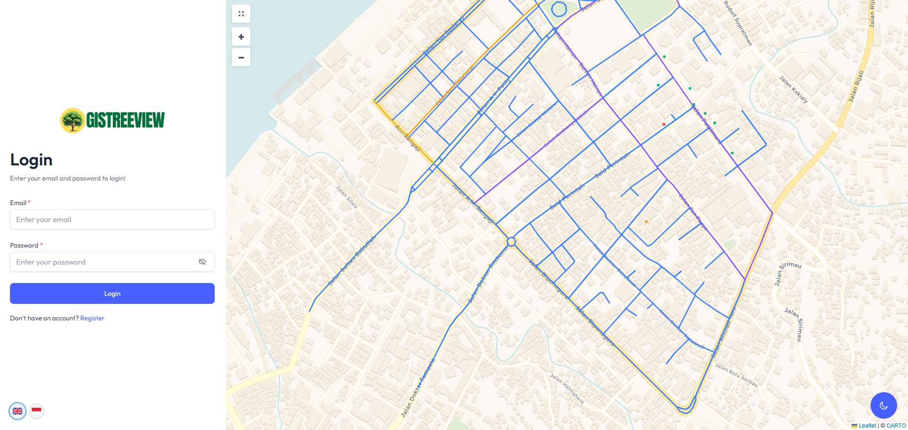

# GISTREEVIEW Frontend

This is the frontend application for GISTREEVIEW, a geographic information system for tree management and road monitoring in Ambon city.



## Features

- 🗺️ Interactive map with road and tree visualization
- 🌳 Tree management system
  - Add new trees with precise GPS coordinates
  - Edit tree information and status
  - View tree details and history
  - Upload tree pictures
- 🛣️ Road management features
  - Visualize roads with color-coding
  - Edit road information and status
  - Track trees along roads
- 👥 User roles and permissions
  - Admin: Full system access
  - Officer: Tree and road management
  - User: View and report features
- 🌓 Dark/Light theme support
- 🌐 Multilingual support (English/Indonesian)
- 📱 Responsive design for all devices

## Tech Stack

- React 18
- TypeScript
- Vite
- Tailwind CSS
- Leaflet for maps
- i18n for translations
- React Context for state management

## Getting Started

1. Clone the repository
2. Install dependencies:
```bash
npm install
```

3. Set up environment variables:
Create a `.env` file with:
```env
VITE_API_BASE=http://localhost:4000
```

4. Run development server:
```bash
npm run dev
```

The app will be available at `http://localhost:5173`

## Building for Production

```bash
npm run build
```

## Project Structure

```
frontend/
├── public/          # Static assets
├── src/
│   ├── components/  # React components
│   │   ├── Maps/    # Map-related components
│   │   └── ui/      # Reusable UI components
│   ├── config/      # Configuration files
│   ├── context/     # React context providers
│   ├── hooks/       # Custom React hooks
│   ├── locales/     # Translation files
│   ├── pages/       # Page components
│   ├── types/       # TypeScript type definitions
│   └── utils/       # Utility functions
├── index.html
└── package.json
```

## Maps Component Features

- Zoom controls
- Layer picker (OSM, Carto, etc.)
- Location finder
- Road editing tools
- Tree management tools
- Status filters

## Contributing

1. Create a feature branch
2. Make your changes
3. Submit a pull request

## License

This project is proprietary and confidential.

## Credits

- Map data © OpenStreetMap contributors
- Tiles by Carto
- Icons from various sources (credited in code)
- [TailAdmin](https://tailadmin.com/) - Dashboard template and UI components
- Dashboard UI based on TailAdmin's open-source template